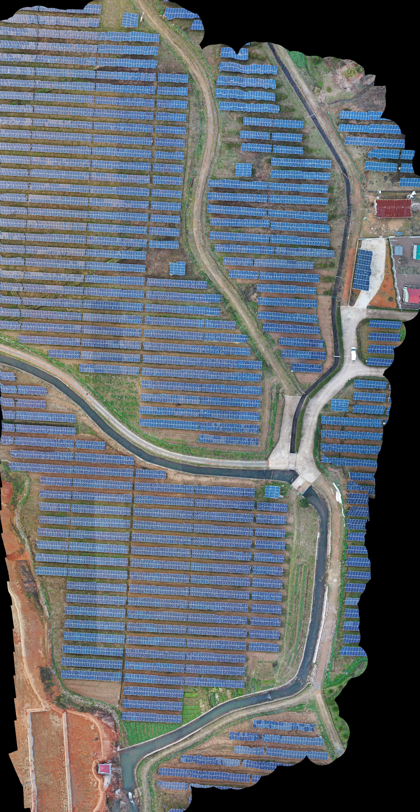

# SkyMerge

基于C++的高性能图像拼接系统

## 软件依赖
- **CMake** 4.0+
- **C++23** 兼容的编译器（GCC 13.3.0可用）
- **CUDA** 12.6.0+
- **OpenCV** （图像处理）
- **Ceres Solver** 2.2.0（优化算法）
-S **ONNX Runtime** 1.21.0（深度学习推理）
- **PCL**（点云处理）
- **Eigen3**（线性代数）
- **Exiv2**（EXIF数据处理）

## 快速开始

### 1. 安装Docker和NVIDIA Container Toolkit

### 2. 加载SkyMerge镜像

```bash
# 从tar文件加载Docker镜像
sudo docker load -i skymerge.tar
```

### 3. 运行SkyMerge容器

```bash
# 运行容器（替换为您的实际路径）
sudo docker run --gpus all -it \
  -v /path/to/your/input/images:/input \
  -v /path/to/your/output:/output \
  skymerge:latest
```

### 4. 编译源代码

```bash
cd /root/DOM
rm -r build
mkdir build
cd build
cmake .. && make -j$(nproc) && make install
```

### 5. 在容器内执行程序

```bash
skymerge /input /output
```

## 使用方法

### 基本用法

```bash
skymerge <input_directory> <output_directory>
```

### 输入要求

- 图像格式：支持常见格式（JPEG、PNG、TIFF等）
- 图像质量：建议使用高分辨率图像
- 重叠度：相邻图像间建议有30-70%的重叠区域
- EXIF信息：图像应包含相机参数等EXIF、XMP数据，其中XMP数据是按照大疆的格式进行读取，目前只适配大疆无人机

## 处理流程

程序按以下5个步骤处理图像：

1. **[1/5] 获取图像信息**：读取并分析所有输入图像的元数据和特征
2. **[2/5] 图像旋转校正**：对图像进行几何校正以便于匹配
3. **[3/5] 邻域图像匹配**：识别并匹配相邻图像间的对应点
4. **[4/5] 三角测量**：基于匹配点计算三维结构
5. **[5/5] 图像拼接**：生成最终的拼接结果

## 配置选项

### 编译配置选项

项目支持以下编译时配置，在`CMakeLists.txt`中5到12行进行设置：

- `LOG_LEVEL`：日志级别（默认：INFO）
- `WANTED_BUILD_TYPE`：构建类型（DEBUG/RELEASE，默认：RELEASE）
- `ENABLE_VISUALIZE_OUTPUT`：启用中间产物输出
- `ENABLE_PARALLEL`：启用CPU多线程并行处理，自动使用最大线程数（默认：TRUE）
- `ENABLE_ASSERTION`：启用断言检查（默认：TRUE）

### 参数配置

项目的配置参数在`include/config.hpp`文件中定义：

#### 特征提取配置
- `FEATURE_EXTRACTION_METHOD`：特征提取方法（SUPERPOINT/DISK，默认：DISK）
- `SUPERPOINT_THRESHOLD`：SuperPoint特征阈值（默认：0.25）
- `SUPERPOINT_KEYPOINT_MAXCNT`：SuperPoint最大关键点数量（默认：1024）
- `DISK_THRESHOLD`：DISK特征阈值（默认：0.25）
- `DISK_KEYPOINT_MAXCNT`：DISK最大关键点数量（默认：1024）
- `FEATURE_EXTRACTOR_RESOLUTION_LIM`：特征提取器分辨率限制，超过会保持长宽比resize（默认：1024，不大于1024x1024）

#### 匹配配置
- `LIGHTGLUE_THRESHOLD`：LightGlue匹配阈值（默认：0.75）
- `MATCH_CNT_THRESHOLD`：匹配点数量阈值（默认：50），不少于该值
- `NEIGHBOR_PROPOSAL`：匹配邻域图片数量（默认：16，匹配就近16张图）

#### 内存和性能配置
- `MEM_LIMIT`：系统内存限制（默认：16GB）
- `GPU_MEM_LIMIT`：GPU内存限制（默认：4GB），限制用于保存特征的显存用量，不包括ONNXRuntime的用量
- `ORIGIN_RESOLUTION_LIM`：输入的原始图像分辨率限制，超过会保持长宽比resize（默认：10240）

#### 网格配置
- `GRID_LENGTH`：三维化时的网格长度，单位米（默认：0.05），每个网格对应目标图的一个像素

*注：修改这些参数需要重新编译项目。*

## 项目结构

```
DOM/
├── src/                    # 源代码目录
│   ├── entry.cpp          # 主程序入口
│   └── CMakeLists.txt     # 源码构建配置
├── include/               # 头文件目录
│   ├── algo/              # 算法相关
│   ├── ds/                # 数据结构
│   ├── nn/                # 神经网络
│   ├── tools/             # 工具类
│   ├── config.hpp         # 配置文件
│   ├── pipeline.hpp       # 处理流水线
│   └── types.hpp          # 类型定义
├── models/                # 模型文件
├── CMakeLists.txt         # 主构建配置
├── Dockerfile             # Docker构建文件
├── .clang-format          # 代码格式化配置
├── .clang-tidy            # 代码静态分析配置
└── .editorconfig          # 编辑器配置
```
